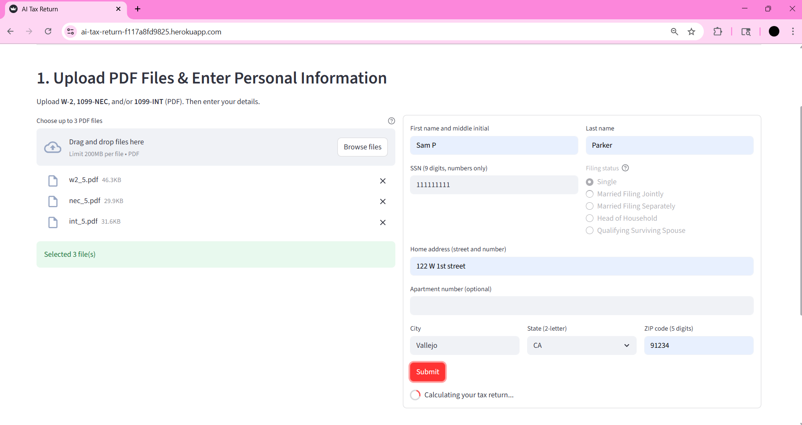
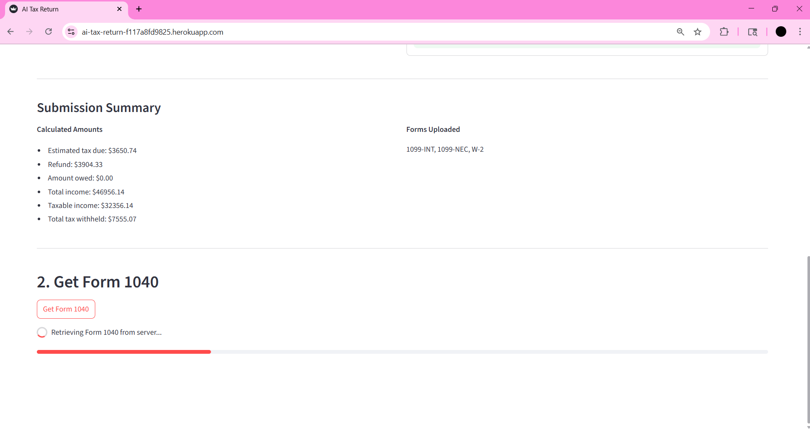
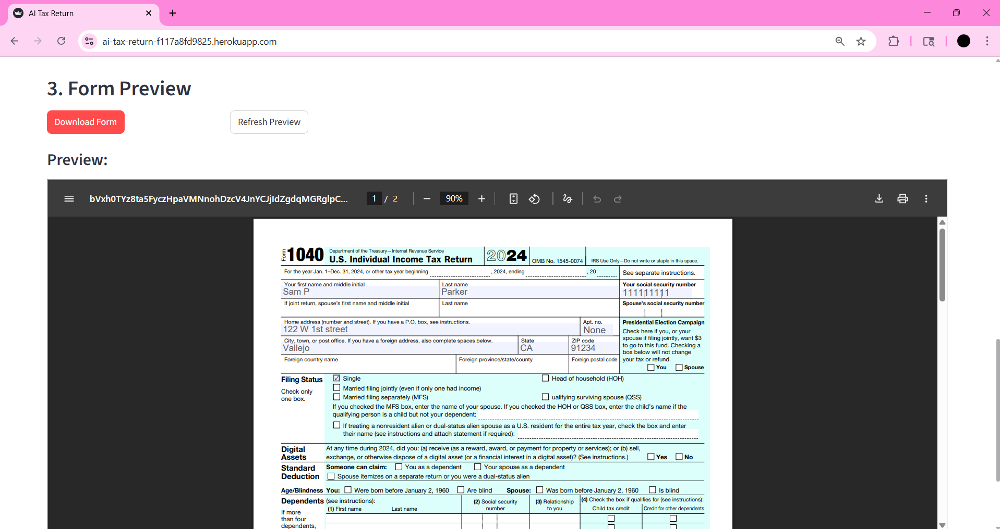
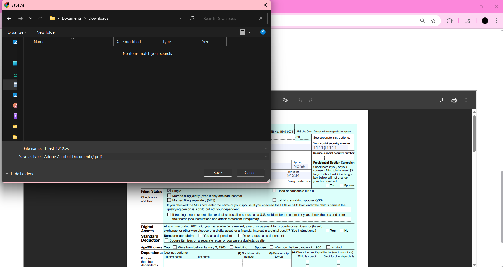
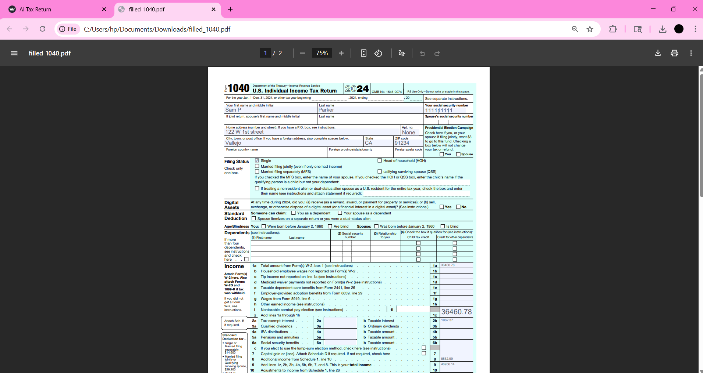
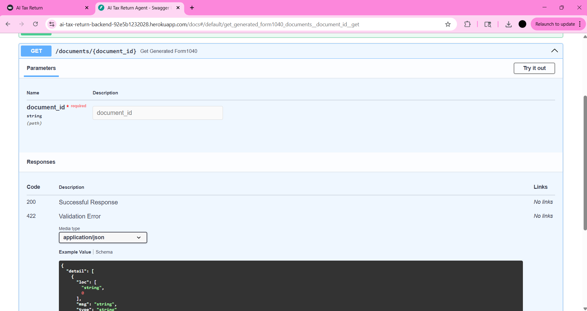

# AI Tax Return Agent Prototype

This is a prototype for an AI-powered tax return assistant that lets users upload common tax documents (W-2, 1099-INT, 1099-NEC), enter personal information (name, SSN, address, filing status) with client-side validation, extract financial data via an LLM, calculate estimated tax using 2024 IRS brackets, and generate a partially pre-filled IRS Form 1040 for preview and download. The current prototype supports Single filing status.

---

## Demo
**Demo Link**: [https://www.loom.com/share/29d10ec035db47e68e2fa76df7156ec1?sid=cfb17204-bebc-4349-b149-2e6da1c0cbc5](https://www.loom.com/share/29d10ec035db47e68e2fa76df7156ec1?sid=cfb17204-bebc-4349-b149-2e6da1c0cbc5)

**Live Frontend**: [https://ai-tax-return-f117a8fd9825.herokuapp.com/](https://ai-tax-return-f117a8fd9825.herokuapp.com/)

**Backend API**: [https://ai-tax-return-f117a8fd9825.herokuapp.com/api/docs](https://ai-tax-return-f117a8fd9825.herokuapp.com/api/docs)

The current flow submits files + Personal Identifiable Information (PII) together and returns a document_id plus an on-screen summary before retrieving the generated Form 1040.

---

## Features

- Upload and process multiple PDF files (W-2, 1099-NEC, 1099-INT)
- Enter personal information (first name + middle initial, last name, SSN 9-digit, address, optional apt no, city, state dropdown, ZIP 5-digit) with frontend validation
- Choose filing status (Single supported today; others shown but disabled)
- LLM-based extraction of wages, nonemployee compensation, interest, and withholding
- Aggregate income and compute taxes using 2024 brackets and standard deduction
- Generate a pre-filled Form 1040 (PDF) and preview in the browser
- Submission Summary showing detected forms, totals (tax due, refund, amount owed), and uploaded filenames
- Clear, user-friendly success and error messages

---

## User Flow

1. **Upload Documents**  
   The user selects up to three PDFs (W-2, 1099-NEC, 1099-INT) and enters personal info (with SSN/ZIP digit-only and state dropdown). Filing status is Single for now.

2. **Submit**
   Frontend posts __multipart/form-data__ to the backend endpoint `POST /submit_tax_form` (files + PII together).

3. **Document Analysis**  
   Uploaded PDFs are sent to the backend, where an OpenAI LLM extracts key financial fields such as wages, nonemployee compensation, interest income, and tax withheld.

4. **Income Aggregation**  
   The extracted values from all documents are aggregated into a unified income and withholding summary.

5. **Tax Calculation**  
   The backend applies 2024 IRS tax brackets and the standard deduction (Single filing status) to compute estimated tax due or refund. The code is available at [`backend/services/tax_calculator.py`](backend/services/tax_calculator.py). The Tax Bracket is generated at [`backend/tax_policy/tax_policy_config.py`](backend/tax_policy/tax_policy_config.py).

6. **Form 1040 Generation**  
   A complete IRS Form 1040 is generated as a fillable PDF, populated with calculated tax data, and personal info.

7. **Submission Summary**
   The frontend displays type of forms submitted, and the totals (tax due, refund, amount owed).

8. **Preview and Download**  
   The user can preview the generated form directly in the browser and download it as a completed PDF for review or filing.

---

## Tech Stack

**Frontend:**
- Streamlit (UI and file upload interface)
- Pydantic v2 (client-side validation)
- Requests (API client)

**Backend:**
- FastAPI (REST API layer)
- Uvicorn (ASGI server)

**AI & Parsing:**
- OpenAI API (LLM-based document field extraction)
- PyMuPDF (PDF text insertion and form generation)

**Form Design & Editing:**
- Adobe Acrobat (Used to create fillable text fields in IRS Form 1040 downloaded from the official IRS website)

**Form Filling and Testing:**
- Faker (mock data generation for dummy documents)

**Data Validation:**
- Pydantic v2 (for strict schema validation of extracted fields)

**Deployment:**
- **Heroku** (Used to host both frontend and backend services for public access)

All dependencies are listed in `backend/requirements.txt`, and `frontend/requirements.txt`.

---

## System Architecture

The architecture is designed to cleanly separate the user interface, backend logic, and AI-powered document understanding.

  
*Figure: High-level architecture of the AI Tax Return Agent prototype*

**Components:**

- **Frontend (Streamlit):**  
  Allows users to upload tax PDFs (e.g., W-2, 1099-INT, 1099-NEC), displays summaries, and lets users preview and download the generated Form 1040. Sends uploaded files to the backend via REST API. The frontend is deployed on **Heroku** for public access.

- **Backend (FastAPI):**  
  Handles PDF parsing, calls the OpenAI API to extract tax-relevant fields, aggregates the results, calculates tax liability using 2024 IRS brackets, and fills out a preformatted Form 1040. The backend is also deployed on **Heroku**, exposing RESTful endpoints.

  - **LLM Integration (OpenAI API):**  
  Interprets uploaded documents and extracts structured fields like income and tax withheld, enabling automation of tax form generation.

  - **Tax Calculation Logic:**  
    Applies the 2024 IRS tax brackets and standard deduction (currently fixed to "Single" filing status) to compute estimated tax due or refund based on aggregated income and withholdings.

  - **PDF Handling (PyMuPDF):**  
  Inserts values into a fillable version of Form 1040, and returns the completed PDF.

## Dummy Documents

The system was tested using mock W-2, 1099-INT, and 1099-NEC documents containing realistic formats and values.

- The dummy files include labeled fields like wages, federal income tax withheld, interest income, and nonemployee compensation.
- These documents are not real and do not contain any PII.

You can find them in the [`backend/sample_docs/`](backend/sample_docs) folder (included in this repository). Please request access separately if needed.

---

## Testing

Tax logic and document parsing were tested using dummy PDFs. Validation includes:

- Accurate extraction of wage and tax data
- Consistent application of 2024 IRS tax brackets
- Correct aggregation across multiple documents

Filing status is currently fixed to **Single**, and the Form 1040 is generated without personal identifiers.

---

## Backend API Documentation

The FastAPI backend exposes endpoints for:

- File upload and parsing
- Tax calculation
- Form 1040 generation

Refer to the Swagger auto-generated API documentation: [https://ai-tax-return-f117a8fd9825.herokuapp.com/api/docs](https://ai-tax-return-f117a8fd9825.herokuapp.com/api/docs)

---

## Security and Compliance Considerations

While this is a prototype and not production-ready, the following concerns are acknowledged:

- The frontend now collects personal information (name, SSN, address, state, ZIP, filing status) with client-side validation.
- PII and files are sent over HTTPS to the backend for on-the-fly processing. Temporary files are created during extraction and form generation.
- This prototype does not include production controls such as long-term encrypted storage, audited access controls, key management, or data retention policies.
- A production system should implement: encryption in transit and at rest, limited retention with secure deletion, secret management, audit logs, PII redaction prior to LLM calls, and comprehensive compliance reviews.

---

## Future Improvements

The current implementation prioritizes core functionality. Planned or recommended enhancements include:

- Support additional filing statuses (Married Joint/Separate, Head of Household, Qualifying Surviving Spouse)
- Robust PII redaction strategies prior to LLM calls
- RAG or tuned lightweight models for deterministic field extraction
- Adding support for additional tax forms
- Real-time error messages and guided walkthrough for users
- State return and itemized deduction support

---

## Reflection

This prototype successfully demonstrates the feasibility of automating personal tax return preparation using AI and document processing tools. Key achievements include accurate LLM-based data extraction, structured tax calculation logic, and partial automation of Form 1040 generation.

What worked well:
- Using LLMs for form-specific field extraction
- Generating text field-based Form 1040 using Python
- Creating dummy documents to test flows realistically
- Serving the filled form back to the user via the frontend

Challenges:
- Redacting sensitive fields like SSNs is non-trivial; locating keywords is easy, but mapping them to nearby values requires spatial logic
- Limited scope of personal input support due to time constraints

Next steps would focus on broadening filing scenarios, enhancing data privacy, and improving the user experience for a production-grade deployment.

---

## Screenshots

Below is a walkthrough of the AI Tax Return Agent prototype using dummy W-2 and 1099 documents. The dummy documents can be found at [View dummy documents folder](backend/sample_docs/15). The resulting Form 1040 is available at [View Form 1040](demo/form_1040_15.pdf).

### User Flow

1. **Landing Page**  
     
   Users are presented with a clean and minimal interface to begin uploading their tax documents, and enter their information.

2. **Upload Documents**  
     
   Users can upload multiple PDFs, including W-2, 1099-NEC, and 1099-INT forms.

3. **Frontend Obtained the Documents**  
     
   Uploaded documents are captured and prepared for backend processing.

4. **Send the Documents and User Information to the Server**  
     
   The user initiates document processing by sending the documents and the user informatin form by calling the backend API.

5. **File Upload Success**  
     
   The backend has successfully received the payload, processed the documents and information, and generated form 1040.

6. **Tax Return Summary**
     
   Upon successful processing, the backend sends a response containing the tax return summary.

7. **Retrieve Form 1040**
    
   A this step, the frontend can fetch the completed Form 1040 from the backend by clicking on the `Get Form 1040` button.

8. **Preview of Form 1040**  
     
   A preview of the generated Form 1040 is shown with tax fields, and user information filled.

9. **Download Form 1040**  
     
   Users can download the completed IRS Form 1040 in PDF format.

10. **Viewing the completed Form 1040**
     
     

---

### Backend API Documentation

API documentation is auto-generated by FastAPI and available at: [https://ai-tax-return-f117a8fd9825.herokuapp.com/api/docs](https://ai-tax-return-f117a8fd9825.herokuapp.com/api/docs)

12. **Backend API Docs Overview**  
     
   Interactive Swagger UI for browsing and testing backend endpoints.

13. **Submit Tax Form Endpoint**  
      
    Accepts tax documents (W-2, 1099-NEC, 1099-INT) for extraction and calculation, and Personal Identifiable Information (PII) from the user.

14. **Get Form 1040 Endpoint**  
      
    Returns the generated Form 1040 as a downloadable PDF file.

---
