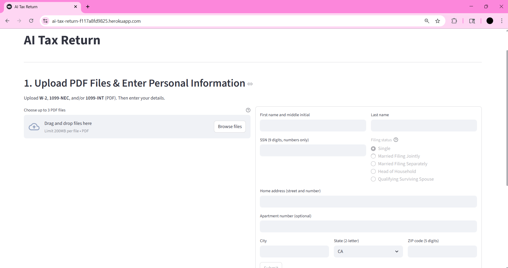
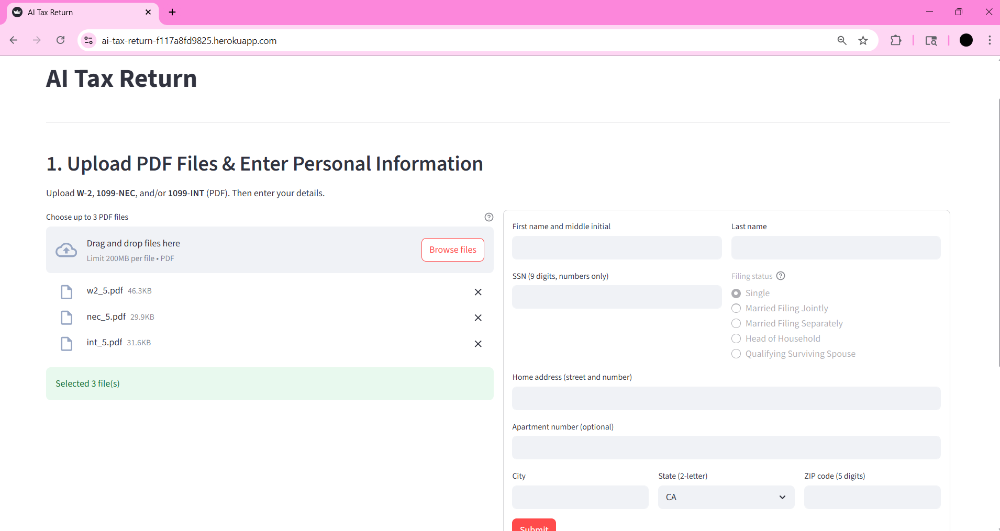

# AI Tax Return Agent Prototype

This is a prototype for an AI-powered tax return assistant that enables users to upload common tax documents (W-2, 1099-INT, 1099-NEC), extract relevant financial data using a large language model (LLM), calculate estimated tax liability using the 2024 IRS tax brackets, and generate a partially pre-filled IRS Form 1040 for download.

---

## Demo

**Video Link**: [AI Tax Return Prototype Loom Video](https://www.loom.com/share/e03f96415ce94ecc80043042f87fec52?sid=be422fbd-018a-4eb7-9e83-d9cbade466aa)

**Live Frontend**: [https://ai-tax-return-f117a8fd9825.herokuapp.com/](https://ai-tax-return-f117a8fd9825.herokuapp.com/)

**Backend API**: [https://ai-tax-return-backend-92e5b1232028.herokuapp.com/docs](https://ai-tax-return-backend-92e5b1232028.herokuapp.com/docs)

The frontend allows file uploads, displays tax calculation summaries, and serves the generated Form 1040 PDF.

---

## Features

- Upload and process multiple PDF files (W-2, 1099-NEC, 1099-INT)
- Extract tax-relevant data using OpenAI LLM
- Aggregate income and tax withholding
- Compute tax liability using 2024 brackets and standard deduction
- Generate a downloadable pre-filled IRS Form 1040 (PDF)
  - Preview before downloading
- Display user-friendly output and error messages

---

## Tech Stack

**Frontend:**
- Streamlit (UI and file upload interface)

**Backend:**
- FastAPI (REST API layer)
- Uvicorn (ASGI server)

**AI & Parsing:**
- OpenAI API (LLM-based document field extraction)
- PyMuPDF (PDF text insertion and form generation)

**Form Filling and Testing:**
- Faker (mock data generation for dummy documents)

**Data Validation:**
- Pydantic v2 (for strict schema validation of extracted fields)

All dependencies are listed in `backend/requirements.txt`, and `frontend/requirements.txt`.

---

## Dummy Documents

The system was tested using mock W-2, 1099-INT, and 1099-NEC documents containing realistic formats and values.

- The dummy files include labeled fields like wages, federal income tax withheld, interest income, and nonemployee compensation.
- These documents are not real and do not contain any PII.

You can find them in the [`backend/sample_docs/`](backend/sample_docs) folder (included in this repository). Please request access separately if needed.

---

## Testing

Tax logic and document parsing were tested using dummy PDFs. Validation includes:

- Correct identification of form types
- Accurate extraction of wage and tax data
- Consistent application of 2024 IRS tax brackets
- Correct aggregation across multiple documents

Filing status is currently fixed to **Single**, and the Form 1040 is generated without personal identifiers.

---

## Backend API Documentation

The FastAPI backend exposes endpoints for:

- File upload and parsing
- Tax calculation
- Form 1040 generation

Refer to the Swagger auto-generated API documentation: [https://ai-tax-return-backend-92e5b1232028.herokuapp.com/docs](https://ai-tax-return-backend-92e5b1232028.herokuapp.com/docs)

---

## Security and Compliance Considerations

While this is a prototype and not production-ready, the following concerns are acknowledged:

- **No sensitive user input (PII) is collected** at this stage (e.g., name, SSN, address)
- Files are processed temporarily and are not stored permanently
- For LLM extraction, redaction strategies are needed to mask PII before sending data to external APIs
  - In my prototype, the backend server itself does not collect any PII
- A production version would require secure additional file handling, input validation, encryption, and audit logging

---

## Future Improvements

The current implementation prioritizes core functionality. Planned or recommended enhancements include:

- Accepting and populating personal information (name, SSN, address, filing status)
- Supporting additional filing statuses beyond single
- Implementing redaction for sensitive information before LLM inference
- Using Retrieval-Augmented Generation (RAG) or fine-tuned lightweight models for offline parsing
- Adding support for additional tax forms (e.g., Schedule C, 1098)
- Real-time error messages and guided walkthrough for users
- State return and itemized deduction support
- Frontend enhancements (mobile responsiveness, form previews, progress steps)

---

## Reflection

This prototype successfully demonstrates the feasibility of automating personal tax return preparation using AI and document processing tools. Key achievements include accurate LLM-based data extraction, structured tax calculation logic, and partial automation of Form 1040 generation.

What worked well:
- Using LLMs for form-specific field extraction
- Generating text field-based Form 1040 using Python
- Creating dummy documents to test flows realistically
- Serving the filled form back to the user via the frontend

Challenges:
- Redacting sensitive fields like SSNs is non-trivial; locating keywords is easy, but mapping them to nearby values requires spatial logic
- Limited scope of personal input support due to time constraints

Next steps would focus on broadening filing scenarios, enhancing data privacy, and improving the user experience for a production-grade deployment.

---

## Screenshots

Below is a walkthrough of the AI Tax Return Agent prototype using dummy W-2 and 1099 documents. The dummy documents can be found at [View dummy documents folder](backend/sample_docs/15). The resulting Form 1040 is available at [View Form 1040](demo/form_1040_15.pdf).

### User Flow

1. **Landing Page**  
   The home screen allows users to begin the process by uploading tax documents and selecting their filing status.

   

2. **Upload Documents**  
   Users can upload multiple PDFs, including W-2, 1099-INT, and 1099-NEC forms.

   

3. **Frontend Parses and Displays Files**  
   The frontend confirms that the documents have been received and are ready for processing.

   

4. **Send Documents to Server**  
   Clicking the "Submit" button sends the uploaded documents to the backend for LLM-based extraction and tax computation.

   

5. **Form 1040 is Generated**  
   After processing, the backend returns a generated Form 1040 PDF with the calculated fields populated.

   

6. **Preview of Filled Form 1040**  
   Users can preview and download the populated Form 1040. PII fields are intentionally left blank in this prototype.

   

---

### Backend API (FastAPI)

7. **API Documentation Overview**  
   The backend is built with FastAPI and exposes auto-generated Swagger documentation.

   

8. **Upload Endpoint**  
   Endpoint to upload and extract data from tax documents.

   

9. **Form 1040 Endpoint**  
   Endpoint to retrieve the generated Form 1040 based on extracted and computed data.

   

---
